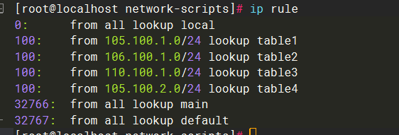

[TOC]

#### 前言

本文主要探索在复杂的网络拓扑测试上，对于多服务器有较高的需求的。怎么通过一个服务器来满足实现多服务器的效果。如下图。基本参数为:

1.  eth1: 105.100.1.0/24
2. eth2：106.100.1.0/24
3. eth3：110.100.1.0/24
4. eth4：105.110.1.0/24


在实现过程中，有几个问题，这里一一记录下。

1. 如果多网卡配置默认路由或者只配置默认路由，出现非对称路由回包，是服务器端不回包。
2. 非对称路由回的包被网关吞包丢弃了（怀疑）


#### 非对称路由回包问题

首先看我的centos7的路由表，只配置了一个默认路由，从eth1回包。就是说我在103.100.1.201 发出一个icmp-request包到eth2（110.100.1.2），正常来说服务器查路由表，将icmp-reply包从eth1出去，回到下一跳。


而我的内核驱动关闭了非对称路由回包。什么意思呢？在ping的时候，你在服务器抓any网口的icmp包，只会看到有request包，而不会有reply包。


很奇怪，明明已经是目的了，怎么没有生成reply包。当然，你理解这个的时候，认为是其实是有生成reply包的，只是不往网卡上发或者往网卡上发的时候被拦截了，所以在网卡上没有抓到。我觉得两种理解都行，现象是一样的，有兴趣的继续深扒。那么怎么看是不是限制了非对称路由回包呢。 filter=1则为限制非对称路由回包。（听说正常应该是关闭限制的） 

```cmd
 sysctl -a | grep '\.rp_filter'
```


那么，关闭限制后，看看会是怎么样的呢？我们发现，eth3口的是只有request包，而reply的包是在eth1口 ？

```cmd
# 修改配置为0 注意时临时配置，重启网络时会重新改回去。
echo "0" > /proc/sys/net/ipv4/conf/all/rp_filter && echo "0" > /proc/sys/net/ipv4/conf/default/rp_filter && echo "0" > /proc/sys/net/ipv4/conf/eth0/rp_filter
```


即使它是非对称回包，但是正常情况是没有影响的，103.100.1.201 应该是可以收到回包了。此时链路就是正常的了。那么，我挂载多张网卡，每张网卡上挂载多个ip，多网卡就意味着存在多个MAC地址了，就能模拟多服务器了。（多IP为了有一些特殊需求），这里列出我的多网卡信息：


```cmd
# 这里赘述一下centos配置ip和路由的情况
cp -p /etc/sysconfig/network-scripts/ifcfg-eth0 /etc/sysconfig/network-scripts/ifcfg-eth1
vi /etc/sysconfig/network-scripts/ifcfg-eth1 # 根据自己需要进行修改配置 (GATEWAY字段按需配置，我这里只配一个网口有默认网关)
touch /etc/sysconfig/network-scripts/route-eth1
echo "103.100.1.0/24 via 105.100.1.1 dev eth1" > /etc/sysconfig/network-scripts/route-eth1  
# 配永久静态路由（统一由eth1回包给PC，105.100.1.1是网关）
service network restart 
# 重启后记得重新关闭非对称路由回包
echo "0" > /proc/sys/net/ipv4/conf/all/rp_filter && echo "0" > /proc/sys/net/ipv4/conf/default/rp_filter && echo "0" > /proc/sys/net/ipv4/conf/eth0/rp_filter
```

打完收工。


#### 链路吞包问题

出事了，出事了~ 有一天突然ping不通服务器了。我看到服务器还是有正常回包。但是路由这里没有抓到包了。唉，很难。不知道是不是非对称回包的被路由器（或者防火墙拦截）丢弃了。呃，翻车翻车。

那就只能是从哪张网口进，哪张网口出了。 这里就要引入策略路由了。一般情况下，策略路由优先于静态路由，静态路由优先于默认路由，那么，在命中静态路由（103.100.1.0/24 via 105.100.1.1 dev eth1）之前，将到eth1网口流量的包，回包由eth1下一跳到网关，这样可以实现需求。同理，将其他的各个网卡都配一遍策略路由，那就可以实现从哪张网口进，哪张网口。

```cmd
echo "202 table3" >>  /etc/iproute2/rt_tables    # 追加一张路由表（table3），权重200到策略路由
ip route flush table table3    # 刷新table3
ip route add default via 110.100.1.1 table table3   # 给table3写入路由，默认下一跳是110.100.1.1（eth3的网关）
ip rule add to 110.100.1.0/24 table table3 pref 100 # 增加路由规则，目的网段为110.100.1.0/24（eth3业务）的，查找命中table3
# 简单解释下：设备拿到一个目的ip为110.100.1.0/24的icmp包后，查看table3的路由进行转发。而table3，让它的下一跳是eth3出去，到eth3的网关。
```

翻车了。这样配是不行的。哈哈，很伤。为什么呢，你细细阅读下上边命令中的简单解释。

没错，进行**转发**。

request包已经到目的了，to 110.100.1.0/24 这个转发动作不再发生了。所以这个策略路由是不命中的。

那么思考下，下一个转发动作要怎么发生？

回包时发生转发动作：from 110.100.1.0/24 watch table3（icmp-reply的源为110.100.1.2，开始回包。命中table3）

```cmd
# 删除已有规则
ip rule del table table3
ip rule add  from 110.100.1.0/24 table table3 pref 100
```

配置完后的路由规则

```cmd
ip rule  # 查看路由规则

```



```cmd
ip route show table table3
# default via 110.100.1.1 dev eth3 
```

可以了。这下可以在eth3上抓到request包和reply包了（这里我换了一台同网段PCping的，不过没关系，同理）


```cmd
# 那其他网口的一并加上吧
echo "203 table1" >>  /etc/iproute2/rt_tables  
ip route flush table table1 
ip route add default via 105.100.1.1 table table1  
ip rule add from 105.100.1.0/24 table table1 pref 100

echo "204 table2" >>  /etc/iproute2/rt_tables  
ip route flush table table2
ip route add default via 106.100.1.1 table table2  
ip rule add from 106.100.1.0/24 table table2 pref 100
```

最后，这样配的策略路由是临时的。需要将它永久配置，这里提供一个简单的方法：加到开机运行脚本中：/etc/rc.local 

```cmd
# 如下命令追加到/etc/rc.local中

ip route flush table table1
ip route add default via 105.100.1.1 table table1
ip rule add from 105.100.1.0/24 table table1 pref 100

ip route flush table table2                                                                                                        
ip route add default via 106.100.1.1 table table2                                                                                 
ip rule add from 106.100.1.0/24 table table2 pref 100

ip route flush table table3                                                                                                        
ip route add default via 110.100.1.1 table table3                                                                              
ip rule add from 110.100.1.0/24 table table3 pref 100
```

打完收工。