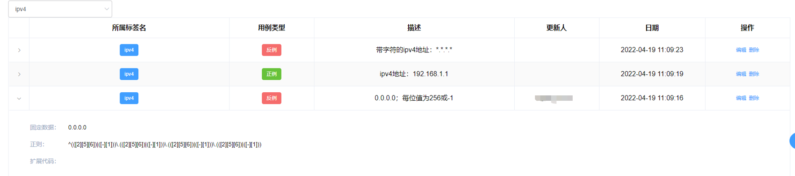
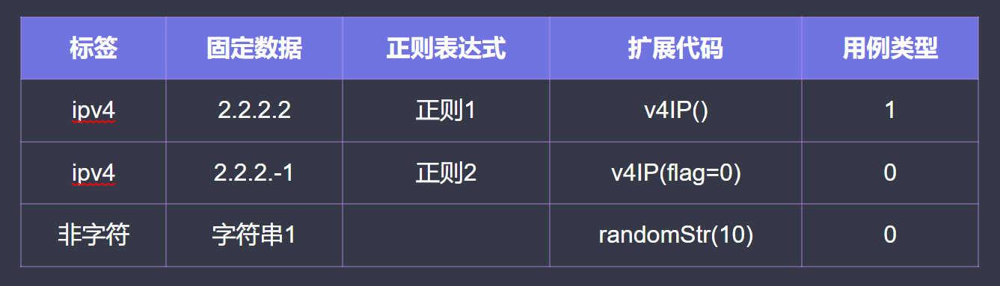

# 单API的自动化数据中心设计逻辑

本文主要交代下我对单API测试数据中心的一些设计想法。

### 关键性逻辑支撑

1. ##### 对同类型的功能性入参的限制应该是要保持一致的

   作者认为在一个成熟的产品中，对于同类型同功能意义的字段应该是要高度一致的，譬如网关产品的ip、网关等，输入限制也应该是一致的；

   1. 譬如接口中定义网络地址时就应该定义为ip、host、srcip等有效的有限的字段，**字段名别搞得花里胡哨**。
   2. 譬如网关、ip等**同类字段的输入限制就应该是一致的**，如ipv4，-1.-1.-1.-1。
   3. 其他的譬如端口或姓名等就**应该有同一的产品线的标准，任何接口定义该类字段都应遵守**。

   故在产品线内是完全可以以属（或者类）的概念设计接口中高度同属的字段的测试数据的。从而自动生成用例case。
   
2. ##### 对于限制重复的参数采用动态随机值的形式以保证可用

   对于如新增用户的接口中的唯一值限制，采用代码扩展生成动态随机值的形式来保证可用
   
3. #####  json schema的反向扩展应用

   面向存在接口schema的字段，人工反向输出一个正则表达式，利用正则表达式构造反例数据，而直接使用schema来生成正例测试数据。
   
4. ##### 单接口测试中对响应体的判断应该剥离业务

   对于单接口的自动化测试，应着重关注其结构的完整性，而非业务功能。建议只关注响应体的完整性，面向状态码、响应体标准码、标准信息、字段集合进行检验。

<br>


### 设计逻辑

1. 标签化类别
   如下图，创建一个标签，收集字段。

2. 给类别定义测试数据

   

3. 添加通用型正反例


### 核心代码

以POST请求体为例：{"ip": "9.9.9.11", "mask":"255.255.255.0", "gateway":"9.9.9.254"}，原始API存在示例合法数据。

ip属于ipv4；属于非字符。如存在如下数据：



#### 业务逻辑：

1.  根据字段查询到所属标签，进而查询到固定数据、正则表达式、扩展代码的字符串
   ```sql
   select case_data,re_expression,python_extend,case_type from api_pulic_data where tag_id in (select id from tags where mark = "ip")
   
   # 此处在设计上，ip字段可能同时属于不同标签。
   sqlQuery = [{"case_data":"2.2.2.2", "re_expression":"正则1", "python_extend":"v4IP()", "case_type":"1"}...]
   # 加工下生成如下的整合数据。
   positiveCases= {"case_data":["2.2.2.2",...], "re_expression":["正则1",...], "python_extend":["python_extend_data=v4IP()",...]}
   negativeCases = {"case_data":["2.2.2.-1","字符串1",...], "re_expression":["正则2",...], "python_extend":["globals()['python_extend_data']=v4IP(flag=0)","globals()['python_extend_data']=randomStr(10)",...]}
   ```

2. 将正则数据和代码扩展整合
   ```python
   # 正则：
   def get_re_data(re_ex='^(.*)$'):
       """
        引用第三库，根据正则表达式生成数据
       :param re_ex: 正则表达式； 默认 全量字符表达式
       :return: 数据
       """
       _x = Xeger()
       return _x.xeger(re_ex)
   
   # 扩展代码
   def get_python_extend_data(code_str, arg_string='python_extend_data'):
       """
       执行python代码, 代码内会产生一个全局变量。 执行完代码后，返回该全局变量
       :param code_str: string; python代码块
       :param arg_string:  python代码块中全局变量的变量名; 默认为 python_extend_data;
       :return:  返回从全局变量中的python_extend_data字段。
       """
       try:
           # 扩展代码村存放在extend_code.py
           from extend_code import *
           exec(code_str)
           return globals().get(arg_string, f'扩展的python代码块内未定义全局变量: {arg_string}')
       except Exception as e:
           print(e)
   
   def main(rules_dict, arg_string='python_extend_data'):
       """
       执行python代码, 代码内会产生一个全局变量。 执行完代码后，返回该全局变量
       :param rules_dict: 正例(positiveCases)或者反例(negativeCases)
       :param arg_string:  python代码块中全局变量的变量名; 默认为 python_extend_data;
       :return:  返回所有的正例数据或者反例数据
       """
    # 固定数据，直接取即可
       case_data = list(rules_dict.get('case_data', []))
       # 正则表达式数据，利用第三方库自动生成
       re_data = (list(map(get_re_data, rules_dict.get('re_expression', []))))
       # python扩展代码块数据，exec代码块后，以arg_string变量来引用，加入到列表。
       python_extend_fun = rules_dict.get('python_extend', [])
       if python_extend_fun:
           python_extend_data = (list(map(get_python_extend_data, python_extend_fun, [arg_string] * len(python_extend_fun))))
       else:
           python_extend_data = []
       # 数据合并
       return case_data + re_data + python_extend_data 
           
   ```

   

3. 加入共性用例数据
   ```python
   POSITIVE_CASES = []  # 产品线的公共正例
   NEGATIVE_CASES = [None, ""] # 产品线的公共反例例
   positiveCases += POSITIVE_CASES
   negativeCases += NEGATIVE_CASES

4. 在示例数据内进行保持唯一变量构造请求体发送后断言
   ```python
   if positiveCases and 200 == request.status_code and ...：
   	result.append(1)
   elif negativeCases and 200 != request.status_code and "失败":
       result.append(1)
   else:
       print(request, response)
       result.append(0)
   	
   ```

剩下的就是考虑如何设计用例数据和维护一个比较庞大的数据中心了。

<br>

### 其他扩展

除了如上的内容验证以外，其他的接口测试角度大概的基础逻辑如下（需要API各个字段的类型和属性）：

1. 必填项校验
   1. 单一缺失：将参考参数中的必填性参数逐一删掉，然后进行调用，断言接口响应信息
   2. 多缺失：将参考参数中的必填性参数，两两缺失，然后进行调用，断言接口响应信息
   3. 全缺失：将参考参数中的必填性参数全部删掉，然后进行调用，断言接口响应信息
2. 空值验证
   1. 必填性参数值为空：将参考参数中的必填性参数的值置空，然后进行调用，断言接口响应信息
   2. 参数值部分为空：将参考参数中的非必填参数的值置空，然后进行调用，断言接口响应信息请求体为空
   3. Json：请求体为空JSON
3. 参数类型验证
   1. string >>int：将参考参数中的int类型的参数值改成string型，然后进行调用，断言接口响应信息
   2. int >>string：将参考参数中的string类型的参数值改成int型，然后进行调用，断言接口响应信息
   3. bool>>0,1: 如有布尔型的参数，将值改为0/1,然后进行调用，断言接口响应信息
4. 内容增强验证（本项需要较多的代码逻辑）
   1. 参数名包含id/no（一般是订单号或者车牌号等）：依托参考参数值，生成同长度的字符串，然后进行调用，断言接口响应信息。如orderNO：2020103000001 >> orderNo:abcdefghijklmn   
   2. 参数名包含type/flag/code/status(一般是标识性参数)：依托参考参数值，填入0/1，ture/false，然后进行调用，断言接口响应信息。
   3. 参数名包含dict/list（一般是详情类参数）：依托参考参数值，将参数转成元组等类型，然后进行调用，断言接口响应信息.
   4. 参数名包含date（一般是日期）：依托参考参数值，改变日期格式：YY-mm-dd、yyyy-MM-dd"T"HH:mm:ss.SSSXXX。然后进行调用，断言接口响应信息。
   5. 参数名包含time（一般是时间):依托参考参数值，改变时间戳格式：10位时间戳，13位时间戳。然后进行调用，断言接口响应信息。
5. 长度验证
   1. 如int类型，最长长度是32位，那么对int类型的参数，传入33位长度的数值，然后进行调用，断言接口响应信息。
6. Content-Type验证
   1. 如参考headers：将application/x-www-form-urlencoded>>application/json 互转；
   2. 如 multipart/form-data >> application/octet-stream 互转。然后进行调用，断言接口响应信息。

共勉！