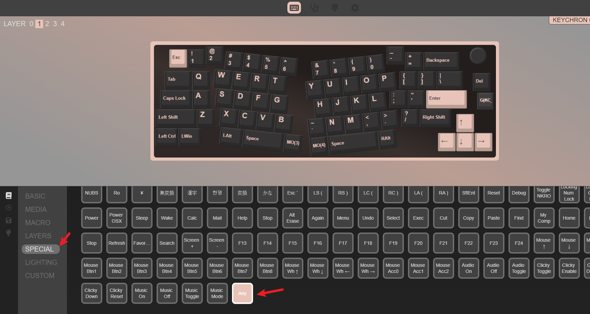
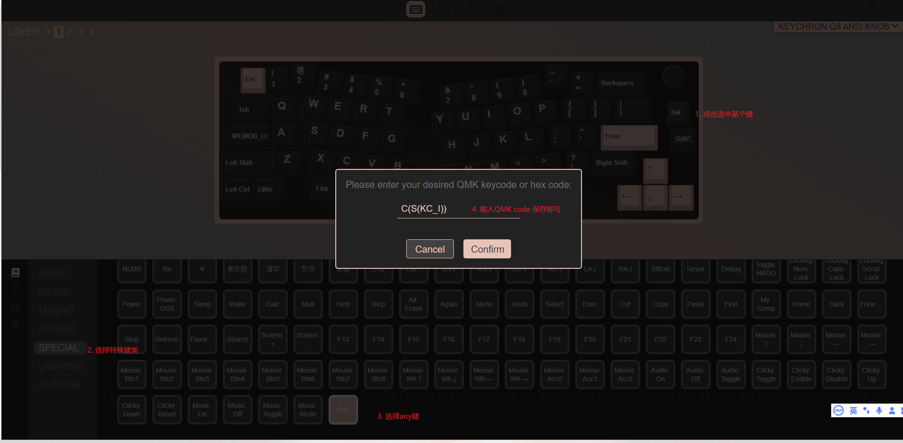
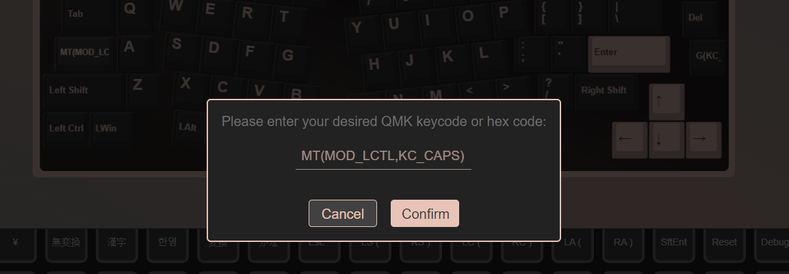
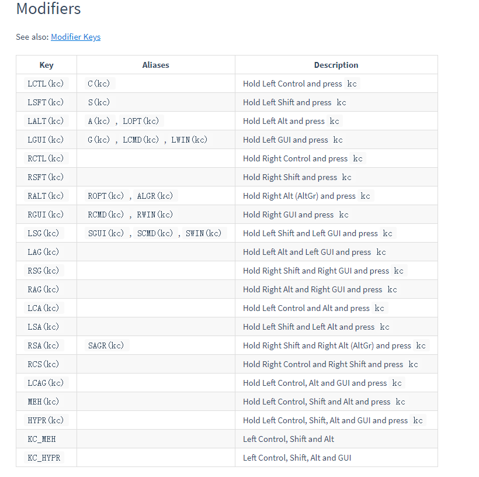
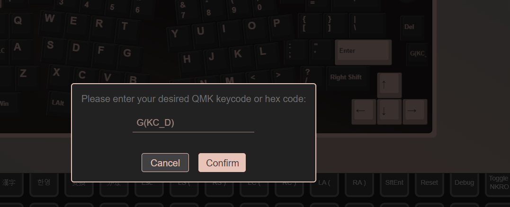
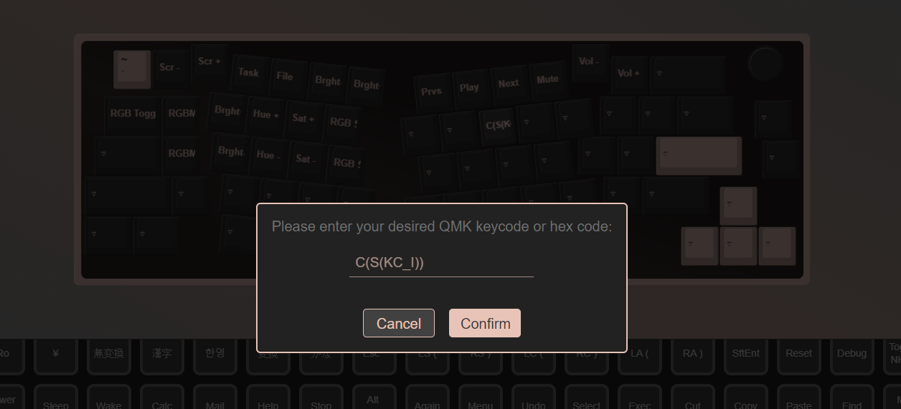
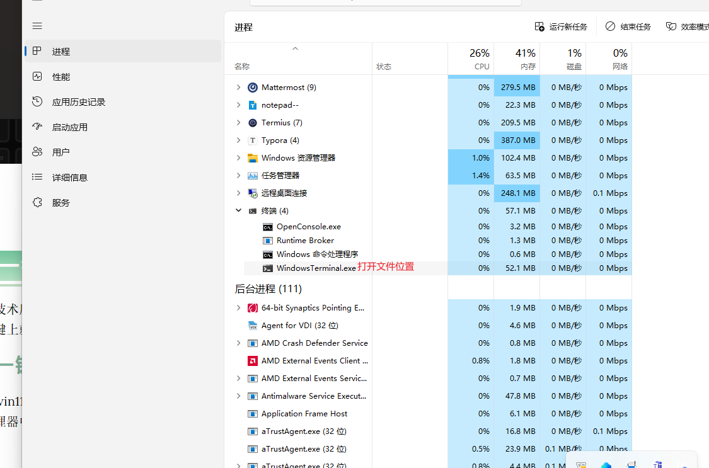
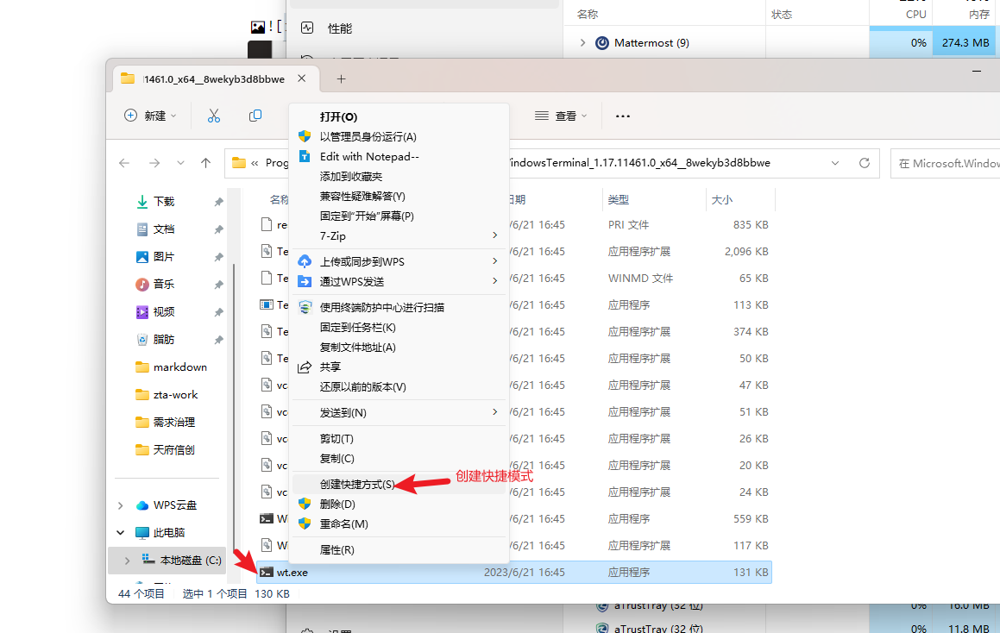
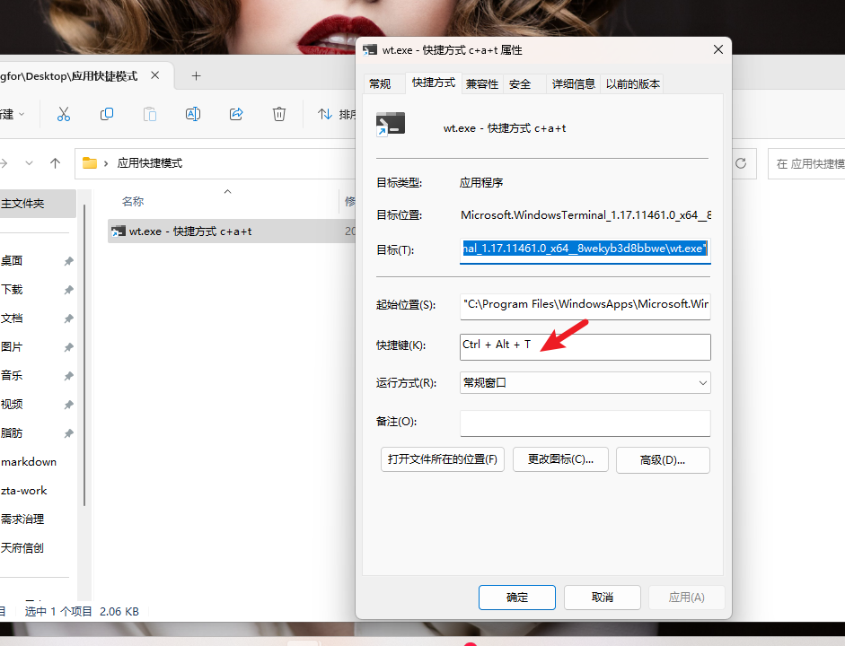
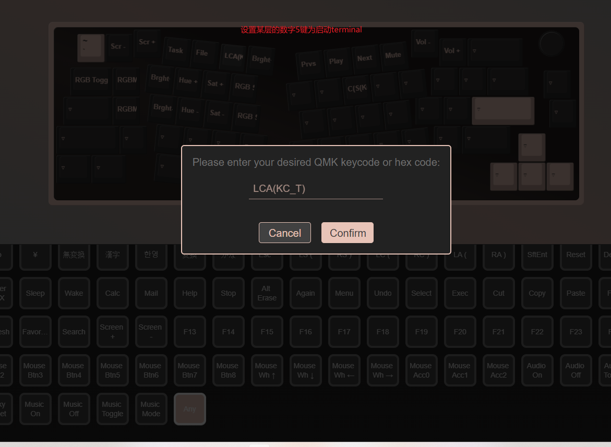

[TOC]

本文讨论下客制化键盘支持QMK或VIA改键的，应该怎么操作呢？讲下我有的两把keychron键盘。Q8和Q3pro铝坨坨。

### via改键

在线改键地址:

https://usevia.app/

#### any键改键

any代表任何一个按键，实现宏完不成的功能。

#### QMK-code码

https://docs.qmk.fm/#/keycodes

KC: 基础功能键; a/A 为KC_A

灯光开关：`RGB_TOG`

灯光模式+：`RGB_MOD`

灯光模式-：`RGB_RMOD`

#### LT类切层键

短按时输出KC键，长按时临时触发至某个层

格式：`LT(layer, kc)`   

例子:  给键A设置 `LT(2, KC_A) `， 那么短按时为a键，长按时为切换至2层，此时再按其他键或a键，就是2层的键值了，这样就快速切层补充小配列位置不够的问题。

---

#### MT类修饰键

Mod-Tap keys  短按时输出KC键，长按时输出modifier键

格式：`MT(mod,kc)`

mod键有：`MOD_LCTL`、`MOD_LSFT`、 `MOD_LALT`、`MOD_LGUI`、`MOD_HYPR`、`MOD_MEH`等几个。

例子：给caps大写锁定键设置`MT(MOD_LCTL,KC_CAPS)`，那么短按时为大小写锁定，长按时为ctrl。这样的话，复制粘贴时，尾指就不用弯到最下边按Ctrl，舒服多了。

---

#### 修饰组合键

修饰组合键分shift修饰、ctrl修饰、alt修饰、GUI修饰这些**同时按住mod键和kc键**。

如上

shift修饰： `LSFT(kc)`，或用别名：`S(kc)`  

例子： 将delete键改为永久删除（`shift+delete`） `S(KC_DEL)`或 `LSFT(KC_DEL)`   直接大胆些，提示永久删除。

`LWIN(KC_D)` 或者`G(KC_D)` 将你的home键变更为`win+D` ，快速回到桌面吧。
将第二层的空格键设置为`win+L` 锁屏，设置`G(KC_L)` ,然后开展你的 fn+空格来锁屏吧。  

#### 多层组合修饰键

如chrome的开发者工具的快捷键是`Ctrl+Shift+i`，那么将某个键设置为`C(S(KC_I))` 或者`RCS(KC_I)`, 在chrome器浏览时，点击这个键就直接打开开发这工具了。贼强。

### 一键打开应用

技术原理： 给应用创建快捷方式，然后给快捷方式设置启动快捷键，然后将组合快捷键改到键盘的某个键上就可以实现一键启动应用

#### 一键打开terminal

win11不支持将terminal固定到开始列表，进而移动到桌面，从而创建出其快捷方式。此时需要在任务管理器中调整到文件所在目录

给快捷方式增加启动快捷键：

此时，使用Ctrl+Alt+t，就可以快速打开terminal了。

改键为`LCA(KC_T)` 即可以完成一键启用应用，如果你的配列大，直接在一层上选一个键来改，完美。

`需要注意,快捷方式需要放到桌面，不支持其他位置的快捷方式，也不可在配置后移动该方式的位置`

自此我的fn+5 就可以快速打开terminal了。秀儿。
