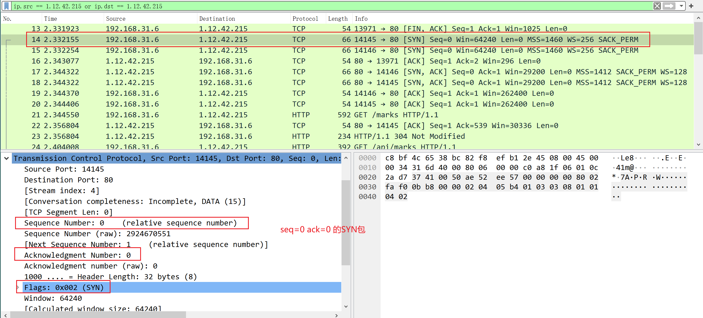
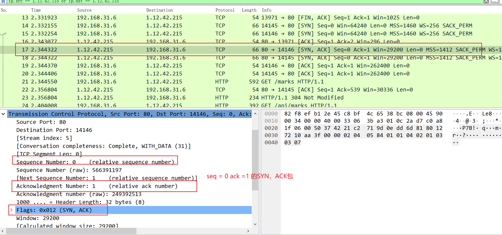
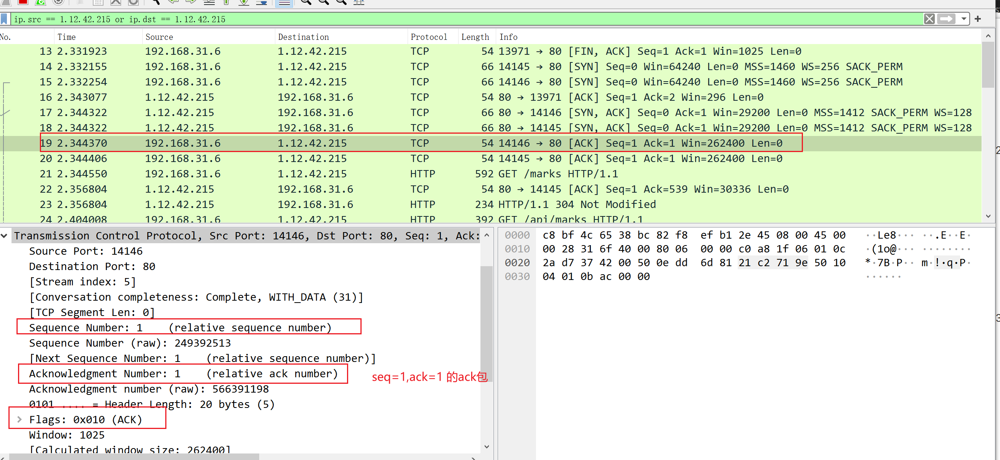

[TOC]


# TCP三次握手

SYN

```cmd
Synchronize Sequence Numbers # 标志位；在TCP协议内容中的Flags中显示；表示希望建立联机；同步序列编号
```

ACK

``` cmd
Acknowledge character # 标志位；在TCP协议内容中的Flags中显示；表示收到并确认。确认字符，表示接受到的字符无错误。

```

## 握手过程

1. client发送一个随机seq值，Seq Num=0，ACK=0，SYN标志的数据包给server

   ```text
   Sequence Number: 0    (relative sequence number)  
   Acknowledgment Number: 0
   ```


   

2. server收到后，回一个随机seq值，Seq Num=0，ACK=1，ACK+SYN标志的数据包给client

   ```text
   Sequence Number: 0    (relative sequence number)  
   Acknowledgment Number: 1    (relative ack number)
   ```
   
   
   
3. client收到后，检查ACK是否等于1，回一个Seq Num=1，ACK=1，ACK标志的数据包

   ```text
   Sequence Number: 1    (relative sequence number)  
   Acknowledgment Number: 1    (relative ack number)
   ```




# TCP的标志位（位码）

SYN(synchronous建立联机)

ACK(acknowledgement 确认)

PSH(push传送)

FIN(finish结束)

RST(reset重置)

 URG(urgent紧急)

```text
    # [client]第一次握手
    Flags: 0x002 (SYN)
        000. .... .... = Reserved: Not set
        ...0 .... .... = Nonce: Not set
        .... 0... .... = Congestion Window Reduced (CWR): Not set
        .... .0.. .... = ECN-Echo: Not set
        .... ..0. .... = Urgent: Not set
        .... ...0 .... = Acknowledgment: Not set
        .... .... 0... = Push: Not set
        .... .... .0.. = Reset: Not set
        .... .... ..1. = Syn: Set
        .... .... ...0 = Fin: Not set
        [TCP Flags: ··········S·]
        
    # [server]第二次握手    
    Flags: 0x012 (SYN, ACK)
        000. .... .... = Reserved: Not set
        ...0 .... .... = Nonce: Not set
        .... 0... .... = Congestion Window Reduced (CWR): Not set
        .... .0.. .... = ECN-Echo: Not set
        .... ..0. .... = Urgent: Not set
        .... ...1 .... = Acknowledgment: Set # ACK
        .... .... 0... = Push: Not set
        .... .... .0.. = Reset: Not set
        .... .... ..1. = Syn: Set # SYN
        .... .... ...0 = Fin: Not set

        [TCP Flags: ·······A··S·] # 缩写，位码为SYN+ACK
    
    # [client]http get请求
    Flags: 0x018 (PSH, ACK)
    000. .... .... = Reserved: Not set
    ...0 .... .... = Nonce: Not set
    .... 0... .... = Congestion Window Reduced (CWR): Not set
    .... .0.. .... = ECN-Echo: Not set
    .... ..0. .... = Urgent: Not set
    .... ...1 .... = Acknowledgment: Set
    .... .... 1... = Push: Set
    .... .... .0.. = Reset: Not set
    .... .... ..0. = Syn: Not set
    .... .... ...0 = Fin: Not set
    [TCP Flags: ·······AP···]
    
    # [server]http/1.1 200 ok 
    Flags: 0x018 (PSH, ACK)
    000. .... .... = Reserved: Not set
    ...0 .... .... = Nonce: Not set
    .... 0... .... = Congestion Window Reduced (CWR): Not set
    .... .0.. .... = ECN-Echo: Not set
    .... ..0. .... = Urgent: Not set
    .... ...1 .... = Acknowledgment: Set
    .... .... 1... = Push: Set
    .... .... .0.. = Reset: Not set
    .... .... ..0. = Syn: Not set
    .... .... ...0 = Fin: Not set
    [TCP Flags: ·······AP···]


	# [server]request Timeout http/1.1 408
	Flags: 0x018 (PSH, ACK)
    000. .... .... = Reserved: Not set
    ...0 .... .... = Nonce: Not set
    .... 0... .... = Congestion Window Reduced (CWR): Not set
    .... .0.. .... = ECN-Echo: Not set
    .... ..0. .... = Urgent: Not set
    .... ...1 .... = Acknowledgment: Set
    .... .... 1... = Push: Set
    .... .... .0.. = Reset: Not set
    .... .... ..0. = Syn: Not set
    .... .... ...0 = Fin: Not set
    [TCP Flags: ·······AP···]
	
	# [server] 结束
	Flags: 0x011 (FIN, ACK)
    000. .... .... = Reserved: Not set
    ...0 .... .... = Nonce: Not set
    .... 0... .... = Congestion Window Reduced (CWR): Not set
    .... .0.. .... = ECN-Echo: Not set
    .... ..0. .... = Urgent: Not set
    .... ...1 .... = Acknowledgment: Set
    .... .... 0... = Push: Not set
    .... .... .0.. = Reset: Not set
    .... .... ..0. = Syn: Not set
    .... .... ...1 = Fin: Set
    [TCP Flags: ·······A···F]

```

