[TOC]

# 写在前面

本文讨论一个在内网部署一个npm应用服务时一些引入导致卡慢的问题。

作者尝试在内网部署reveal-md的时候，打开web页面有很长时间的等待。在这里对排查和修改做下posts记录

当我使用自定义html和指定主题时，打开一个markdown文件，需要40多秒，所有资源加载需要60多秒，主要耗时在请求一些外网资源

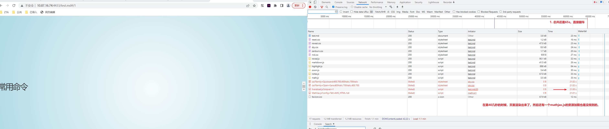

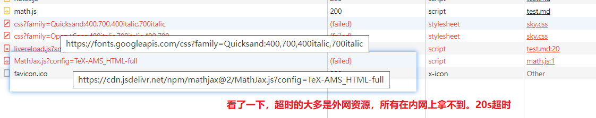

---

# 思考

虽然找到问题了，需要加载外网资源，我是内网的，所有这个操作不了。那就只有两种解决思路了。必备资源的话，需要手动下载到本地，然后修改引用；如果是非必备资源，我就注销掉这个资源的引用了。幸好。从加载的最终效果上看，样式和功能都还算正常。这些超时资源是可以注释掉。

但因为我是直接使用全局安装的，不是用源码安装（具体reveal-md是什么和怎么安装使用的，[可以看我另一个帖子](https://morebooks0.github.io/posts/reveal-markdown)），那我还能改吗？是不是要下载源码下来改完，再打包才能解决（一开始对npm的理解不透彻哈，见谅见谅）。

----

其实我已经开始下载源码来准备修改了。但是还是尝试了一下，看能不能直接在reveal-md命令下改。跟踪了一下文件，发现原来如此，学到了。原来**npm安装的可执行命令，只是软链接到这个服务的执行的js文件。跟手动下载源码执行 node target.js 是一样一样的。**

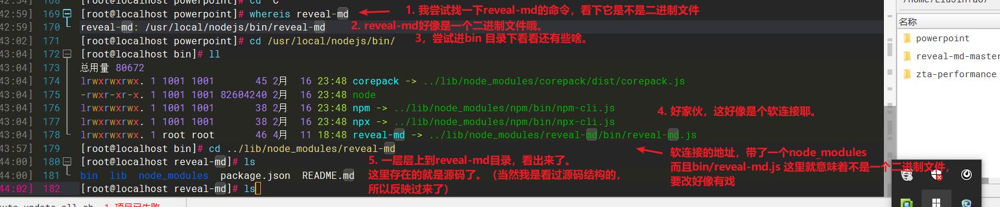

----

# 修改

那么我们一步步地注销掉这个外网资源吧。搜索sky.css 或者这个外网地址看看。原来是自定义的主题中需要引入，那就进入到这个依赖库reveal.js中theme样式中进行注销掉。或者我试试了。换成默认主题（black）就没有额外的引用。不过我觉得black不好看。还是改下sky主题的样式。

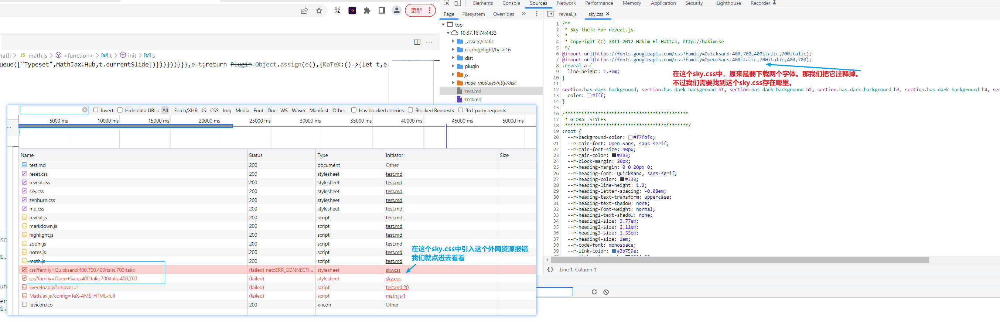

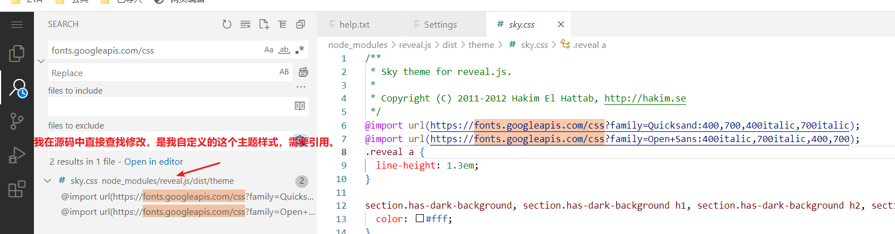

----

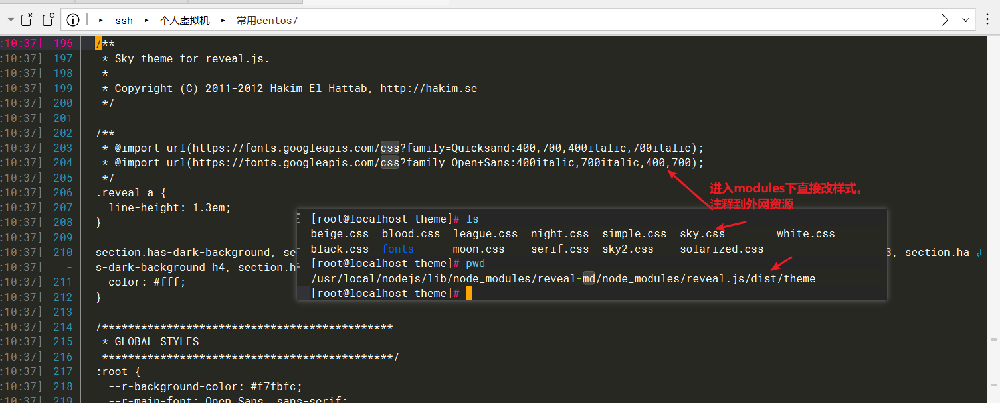

改为运行看看效果。完美。

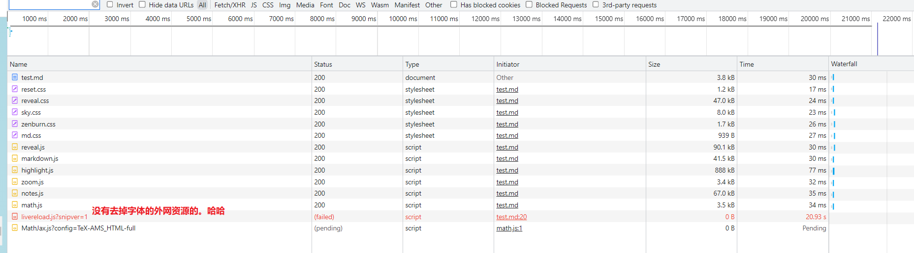

----

接着改这个livereload的资源

----

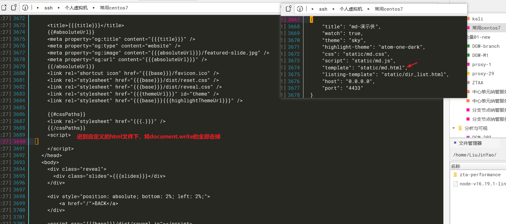

---

接着改这个MathJax.js，在一个插件目录下的math.js。 我们点进去看看是什么样子的。

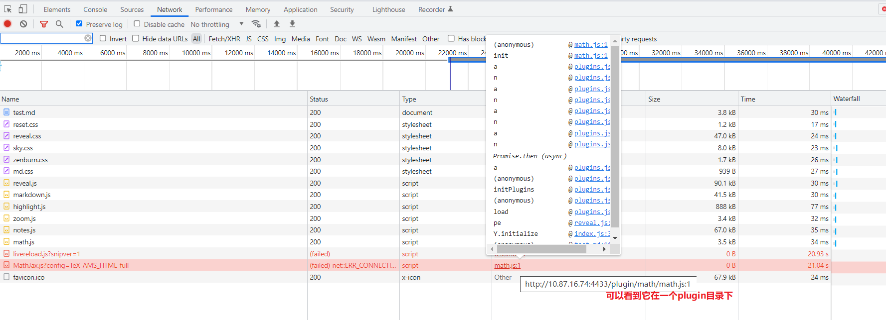

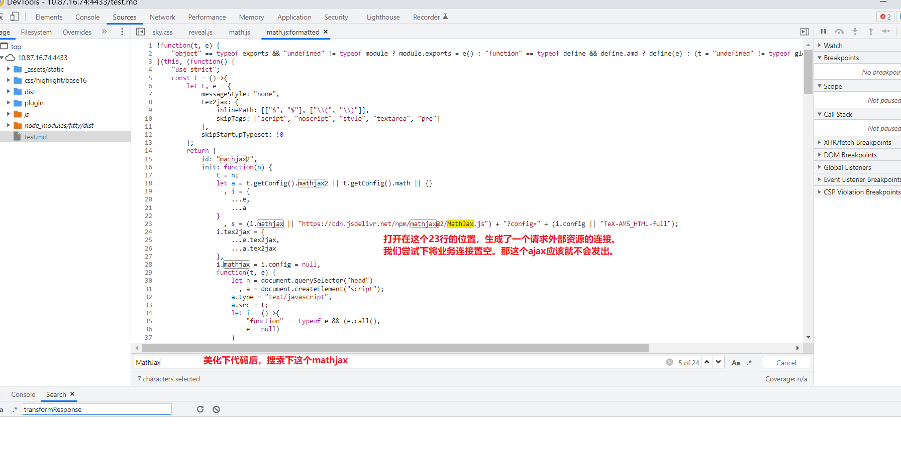

---

进入到reveal.js的插件下，进行修改math.js

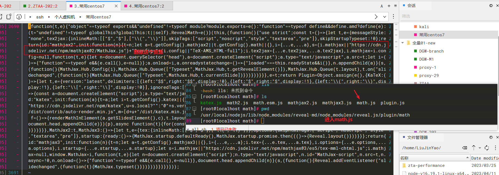

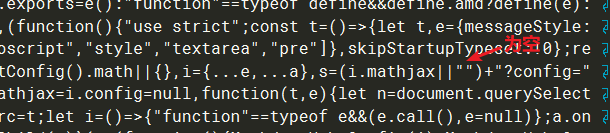

---

# 结果

修改完几个资源后，运行看看。OK了

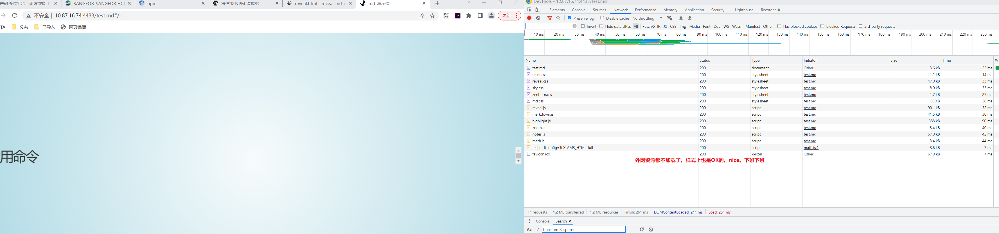

---

# 总结

1. npm安装的服务，可执行命令实际上只是一个软链接，链接到源码下的执行js文件中，所以需要二次开发或修改的，直接进入到该项目中修改即可（如nodejs解压安装目录下/lib/node_modules/reveal-md）

2. 内网中对于第三方库中引入外网资源的情况，有两种解决方法。核心依赖的下载到本地进行引用（不过一般讲，第三方库中的核心依赖会自己打包引入）；如果非核心依赖资源，不影响业务但好似阻塞渲染的，就注销掉吧

   ---

   