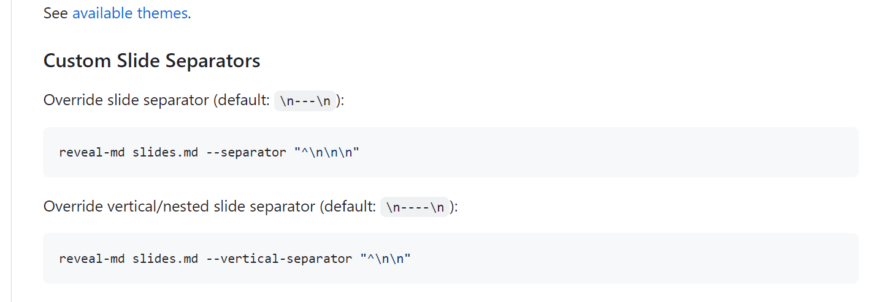
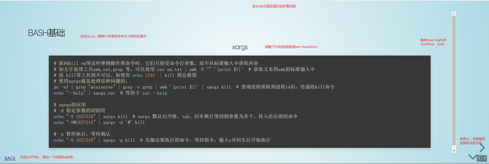

[TOC]

# 写在前面

本文探索用markdown文档来写演示文档啦。帅炸你的同事吧。

参考材料：

1. https://revealjs.com/
2. https://github.com/webpro/reveal-md

---

# 安装

## 全局安装reveal-md

```cmd
npm install -g reveal-md
```

----


## 源码安装

```cmd
git clone git@github.com:webpro/reveal-md.git 
cd reveal-md
npm install 
# 打开当前目录
node ./bin/reveal-md.js ./ 
```

---


# 自定义

## 自定义运行配置

```json
// 在需要打开的markdown文件的目录下创建文件 reveal-md.json 那么使用reveal-md 命令打开目录时，会自动找到该文件作为启动配置项。

{
    "title": "md-演示侠",
    "theme": "sky",
    "watch": true,
    "highlight-theme ": "atom-one-dark",
}
```


----

## 自定义css样式

```json
// 在markdown文件目录下新增static目录下新增md.css 
// reveal-md.json 中增加css为 static/md.css
{
    "title": "md-演示侠",
    "theme": "solarized",
    "watch": true,
    "highlight-theme ": "atom-one-dark",
    "css": "static/md.css",
}
```

----


```css
:root{
    --h1-size: 1em;
    --h2-size: 0.8em;
    --h3-size: 0.6em;
    --h4-size: 0.4em;
    --text-transform: none;

}
/* 布局 */
div.slides{
    width: 100% !important;
    height: 100% !important;
}
.reveal .slides>section{
    max-height: 100%;
    overflow: auto;
}

/* 标题 */
.reveal h1{
    font-size: var(--h1-size);
    text-align: left;
}
```


----

## 自定义HTML

```json
// 在markdown文件目录下的static目录下新增md.html 
// reveal-md.json 中增加css为 static/md.css
{
    "title": "md-演示侠",
    "theme": "sky",
    "watch": true,
    "highlight-theme ": "atom-one-dark",
    "css": "static/md.css",
    "script": "static/md.js",
    "template": "static/md.html",
}
```

----

```html
<!-- html模板地址：https://github.com/webpro/reveal-md/blob/master/lib/template/reveal.html -->
<!-- html模板地址：https://github.com/webpro/reveal-md/blob/master/lib/template/reveal.html -->
<!-- 我这里主要是新增一个回跳回目录页的a标签 所以在body中增加如下-->
    <div style="position: absolute; bottom: 2%; left: 2%;">
        <a href="/">BACK</a>
    </div>
```

---

## 自定义ico

在markdown文件目录下新增favicon.ico；运行时候，网页的ico就会变成自定义的啦。


---

# 其他

## 主题配置

```json
// 应用的是revealjs的主题，直接填入js的文件名即可。见https://github.com/hakimel/reveal.js/tree/master/css/theme/source
sky
solarized
...
```

---

## markdown语法

```text
如typora下，--- + enter（三个横杠下回车）即为一张横向幻灯片
如typora下，---- + enter（四个横杠下回车）即为一张竖向幻灯片
也可以配置Slide Separators来指定（在reveal-md.json定义就行）
```




---


## 结果展示



---

## 谢谢

Power By LiuJinYao
