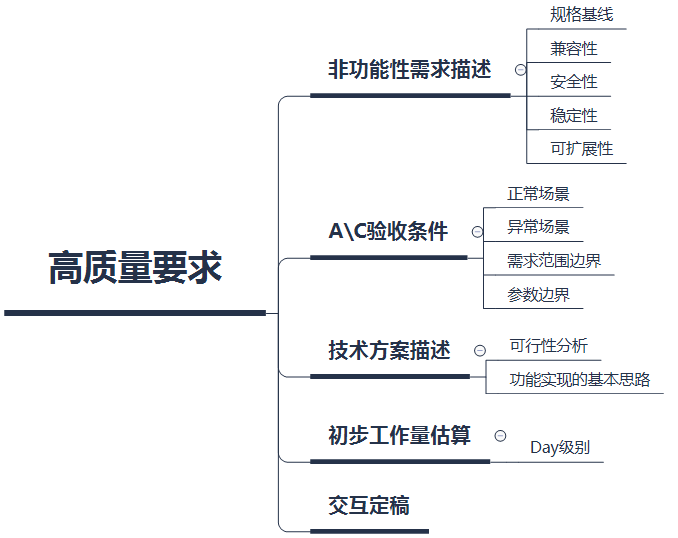
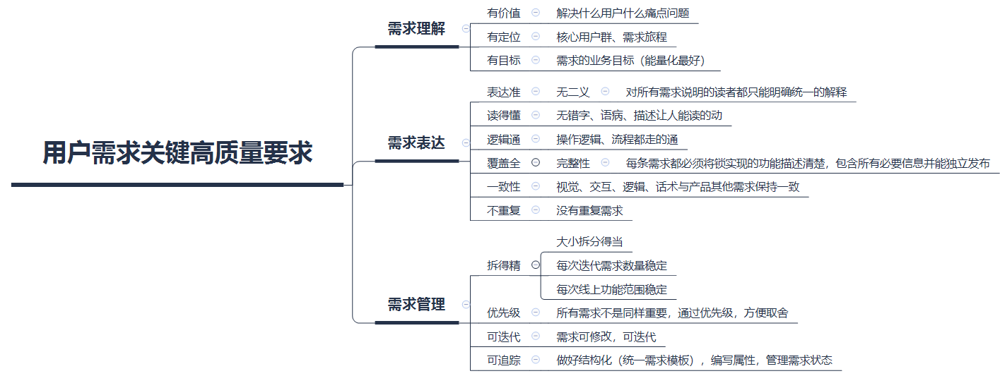

[TOC]

本文探索分析下我所理解的测试怎么驱动需求的高质量化，也包括SANGFOR公司内的当前的一些标准。主要是软件方向哈。

### 背景和目的

1. 从测试管理的角度出发，高质量的需求就是意味着**研发过程的高质高效、风险可控**，更重要的是大大提高可度量性。个人认为项目的准时交付是极度依赖精准的评估工作量的；另外高质量需求往往意味着你可以得到一个高质量产品。

2. 同时不可否认的是，高质量的需求和清晰的需求方向大大减轻测试人员的业务知识库压力。

### 高质量的标准

#### 用户需求精准

1. 有明确的价值属性的，在全局业务中有其明确的定位和演进方向，与整体业务目标至少不矛盾。
2. 内容是正确无二义的、完整和健壮的、与其他需求独立不重复但风格是一致的
3. 有定义完成标准的，技术可实现的，测试可验证的。
4. 颗粒度是可度量估算的、合适的、有优先级的、可追踪的

#### 

### 工作中常见阻碍

1. 可测试性需求识别困难

2. 评审通过的需求还是一句话、缺少用户故事、验收标准、演进方向等

3. 非业务需求缺失

4. 需求细化程度不足

5. 产品价值和目标未清晰传递

### 方式方法

#### 用户需求精准

1.  有没有目标用户？该需求是给什么样的用户解决什么样的问题（客户那边发生了什么事情，导致客户需要这样的东西）？用户目的是什么，过程中的痛点是什么？用户E2E旅程（从用户、系统管理员、审计管理员的角度看事情的发生、发展到结束）？
2.  为什么说这个方案可以解决用户的问题？用户是怎么学会使用这个方案的？他们是怎么理解这个东西的？会不会有理解偏差？
3.  这个方案让用户牺牲了什么？如果你是用户，遇到这样的问题，你希望可以怎么解决？
4.  需求的核心价值是什么？是否有被系统运维需求所影响？
5.  UI层面应用到技术是否成熟？交互是否繁杂冗余？交互设计的可预见性是否符合用户思维？
6.  这个方案的数据流是怎么样的？从产品角度看，哪些是当前系统缺失的？哪些是当前系统已有的？
7.  验收条件场景化了吗？是否已经**将验收用户故事的规格化或场景化**了，正常场景和异常场景有基本的主谓宾描述了吗？
    *在要做什么的时候，谁可以在哪些地方，做什么的东西来达到目的*
    *在什么情况下，谁做什么操作，结果是什么？影响如何？*

#### 系统需求精准

1. 性能指标是否描述了性能模型、性能指标；规格指标是否明确？

2. 需求实现后，当前已有服务中哪些链路被影响了？

3. 方案定义的可用性、兼容性、稳定性、性能、安全、可运维性等是怎么样的？

4. 该方案设计的每一个逻辑分支是否都可以由配置面控制？在兼容当前的架构下配置面落地选择的形式是什么？配置面的变动是否简易易行？

5. 实现需求的第一难点是什么？第二难点是什么？第三难点是什么？

6. 实现方案最优的数据结构是什么？以什么的形式储存？是否具备可观察性？怎么便捷查询观察？怎么便捷修改？是否可提供一键构建测试数据？

7. 配置面各个API的核心参数是什么？关联参数是什么？是不是可以做到极简API？配置成功或失败的标志是否明确清晰？

8. 如果配置面发生变动，怎么提供一键检查业务生效性？一键检查数据链的变动正确性？

9. 时间或异步任务等设计怎么提供精准控制？异步任务怎么保证正确结束

10. 依赖前置异步任务的服务，怎么可以保证异步任务完成后开始服务。

11. 驱动模块是怎么样的？怎么设计可以一键实现驱动数据？

12. 数据流中怎么做MOCK？

13. 错误的定位设计和错误日志暴露的内容？存储形式？可观察性？观察代价？异常模拟和异常复现的难易程度？

    

#### 非功能需求精准

测试性需求见：[TSE系列-03-软件的可测试性是什么？](https://morebooks0.github.io)

### 评价及复盘改进

#### 需求评价

1. 【理解不对】 需求无价值、需求错误、目标不明有偏差
2. 【表达不准】 描述不准、覆盖不全、预期不明、全局不一、有重复、太耦合
3. 【体验不好】 不好用、难理解、没诱惑、不友好、无性能、无安全
4. 【实现不了】 开发实现的可行性差、测试可行性差、人力不足
5. 【管理不好】 需求管理乱、需求拆分不合理、需求无优先级