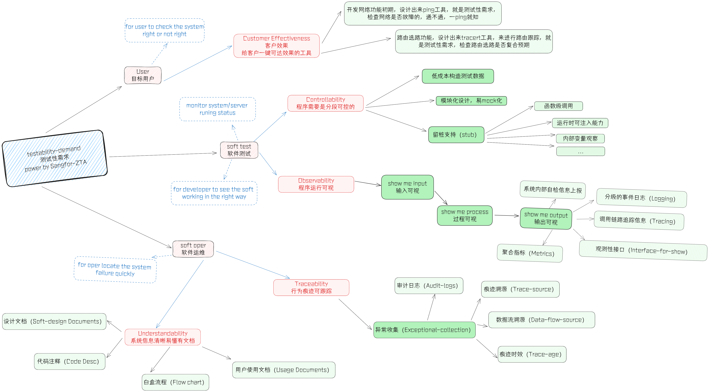

[TOC]

本文探索软件可测试性分析（Testability）。也包括SANGFOR公司内的当前的一些标准。主要是软件方向哈。

在软件研发的过程中，Design for testing 慢慢地成为软件组织核心研发能力的标尺的一部分。这里也介绍下其他的可以关注的Design方向。Design for deployment、 Design for monitor、Design for scale、Design for failure。

### 背景和意义

**Testability：** 计算机程序能够被测试的容易程度。

系统不可测试或测试成本过高，都应该是研发过程中不可接受的。可测试性的分析，就是为了提前规避这个问题，不要累积技术债务。其他的就不在这里过于关注。

### 核心观点及其理解

1.  可测试性是设计出来的
2.  提升可测试性是可以节省研发成本的
3.  关注可测试性是可以提升软件质量的

### 测试性需求

#### 测试性需求标准理解

#### 实操

1. 通过**挖掘**正反例场景中对期望结果的验证手段来输出测试性需求

   1. 有如下这样一个性能场景：
      	32C设备在100%业务流下（4.5K EPS），elink流式处理日志不会堆积
      期望结果是：**不堆积**

      怎么判断是否堆积？就好比喻一个边进水，边出水的池子，怎么样才使池子不堆积溢出呢？

      第一，在稳定的情况下，如果进水速率小于等于出水速率，那就不会堆积；

      第二，如果进水口足够大，那就不会池外堆积；

      第三，进水口足够了，也要看池子够大，如此，也就不会池外堆积。

      这里引出一个容量、存量、生产量和消费速率的概念。

      **存量越来越大，那就意味池内堆积**； 

      **消费速率+容量小于生产量，那就导致池外堆积；**

      如上，可以提出观察组件容量、存量、生产量和消费速率的测试性需求

      或，代码工具提供监控结果，True为未堆积。但其统计逻辑需要合理。

      ----

      

2. 通过**识别场景参与者或系统参与者的角色及职责**，以其角度观察用户场景来输出测试性需求

   ​	**服务部署的难易程度；**

   ​	**服务资源占用的可观测性；**

   ​	**内部模拟异常的难易程度；**

   ​	**外部模拟异常的难易程度；**

   ​	**内建自测测试（BIST）;**

   ----

   

3. 从白盒逻辑中输出测试性需求
   该项不做展开

---

