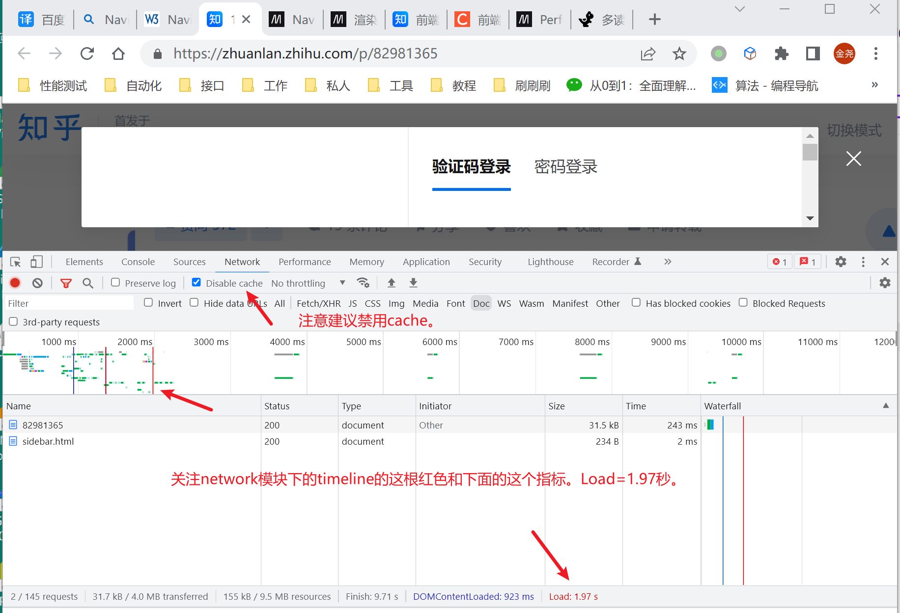
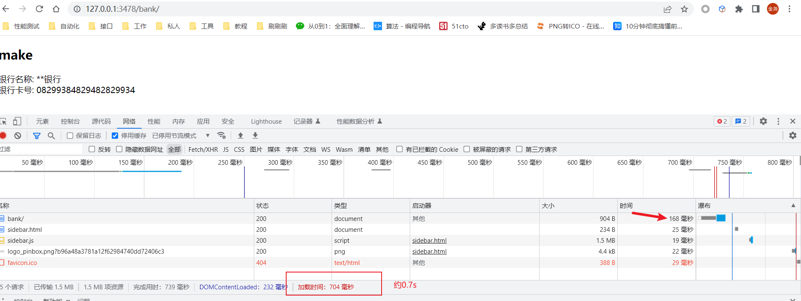
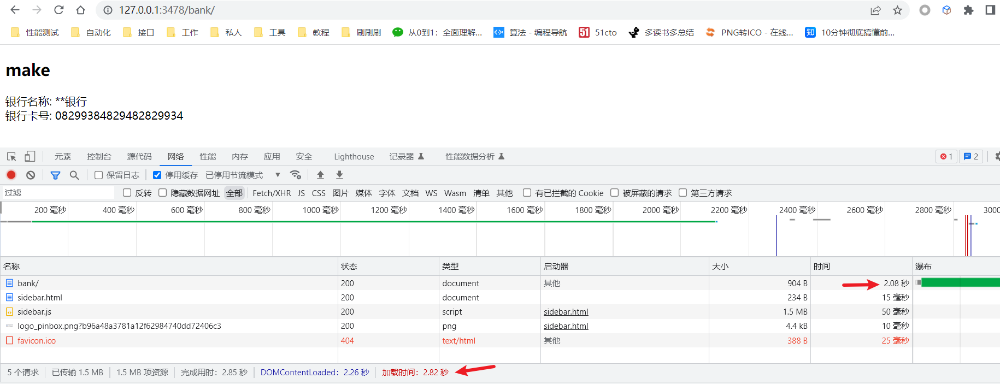
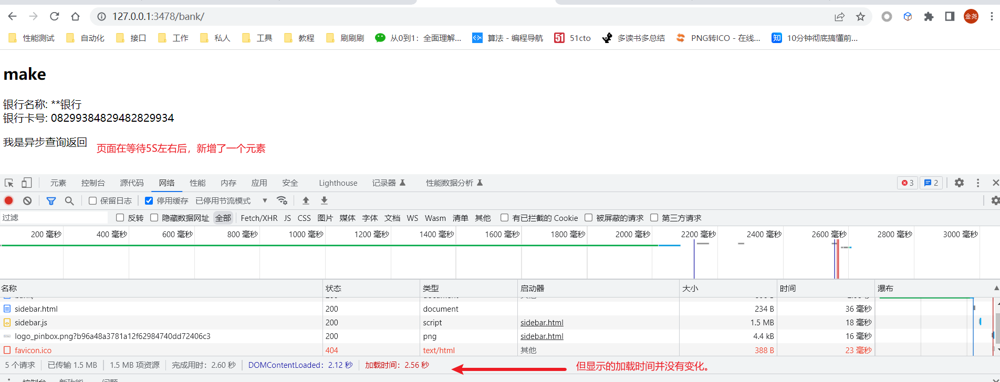
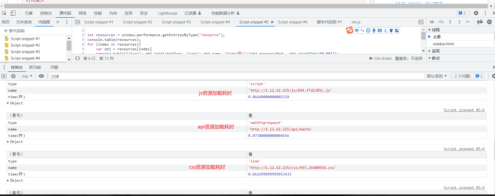
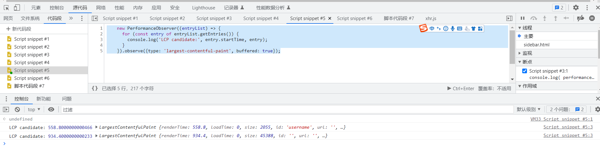
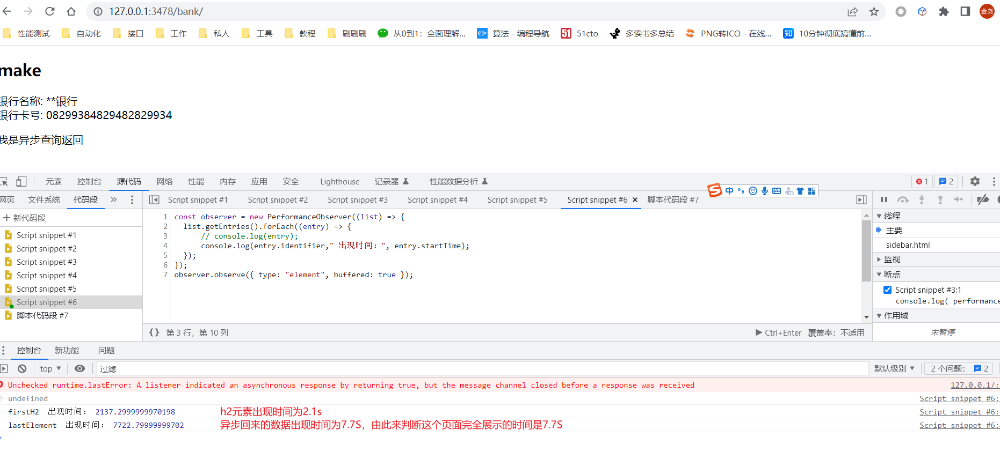
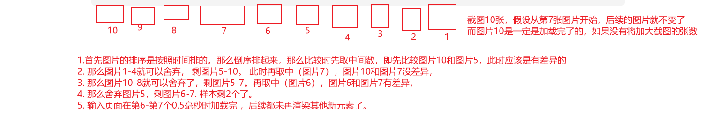

[TOC]

### 背景

本文主要探索自动化测试领域中如何获取前端页面性能的一些方式方法，对web的发展历程也有一些阐述。

1. 浏览器性能对象的timing属性：window.performance.timing

2. 浏览器性能对象的资源属性： window.performance.getEntries()

3. selenium调用devtools工具的performance功能。

4. 埋点（）

5. 人为认定时间差

6. opencv技术

   <br>

### 常用的性能指标和它的意义

LCP（Largest Contentful Paint）：页面最大媒体被加载出来的时间

FP（First Paint）： 首次绘制，开始不同于导航前屏幕内容的时间点
FCP（First Content Paint）：首次内容绘制，首个元素出现的时间，即首屏时间

全部页面时间：这里我喜欢称之为情绪时间，指全部页面载入时间指从最初启动浏览开始，直到所有元素都被加载完成后，在2秒后仍然没有网络活动的时间

<br>

### Performance.Timing

在vue等SPA（single-page-application）应用出现之前，W3C针对前端发展过程（Navigation Timing）制定有了Level1和Level2两个版本的加载过程的性能模型和各项指标。如下图：

1. 当导航开始，网页发生跳转（redirect），伪同时，原网页开始销毁（upload）
2. 等待请求回来后，开始根据js、css、xmlhttprequest等生成DOM树，完成渲染过程
3. 加载完成显示至网页上
4. 重复


而Navigation Timing 的level2 版本，继续深化加强了对获取资源的阶段的规范，定义面向resource的Resource Timing对象，以更细化过程性能。


那么怎么说？ 看例：

1. 直接在devtools上的console功能中调用API，进行差值运行，即可得到网页渲染总耗时。

```javascript
window.performance.timing.loadEventEnd - window.performance.timing.navigationStart
# 或者
window.performance.getEntriesByType("navigation")[0].loadEventEnd * 0.001
```

我们以知乎的一个页面为例观察下。从network模块或者performance模块捕获，或者人为感知下，判断这个页面是渲染大概是2S左右，而network的timeline显示是1.97S。而在红线之后（2S到3.5S这段时间）没做啥事情，那我认为这个页面渲染完全渲染和大部分渲染是成立。那这个1.97S怎么能被获取到呢。



我们可以直接在控制台执行API来获取，得到的结果，就是这个Load的值。哦， nice！


那么，自动化就好办了。存在页面路由List： [A,B,C]，只要打开网页，等待一段时间，然后执行js，就可以获取到性能时间，哇塞，这通用性这么强吗...

```python
from selenium import webdriver
import time
driver = webdriver.Chrome()

def getPerformanceTime(route):
    driver.get(route)
    time.sleep(20) 
    Thetime = driver.execute_script("(window.performance.timing.loadEventEnd - window.performance.timing.navigationStart)/1000")
    return {route:Thetime}

def main(routeList):
    result = map(getPerformanceTime, routeList)
```

不过我试过多次，这个时间多少有些误差，不过不大。

下面在列举一种实例（demo）来帮助大家理解，这个方法获得的是什么样的性能时间。

实例框架：python+Flask（MTV）

1. 首先定义一个Flask Application。该APP定义有一个/bank/路由函数，返回一个case页面：
   ```python
   from flask import Flask, render_template
   
   APP = Flask(__name__)
   
   @APP.route('/bank/', methods=["GET"])
   def fun1():
       data = {
           "user": "make",
           "bank": "**银行",
           "cardID": "08299384829482829934"
       }
       html = render_template("case.html", **data)
       return html
   
   
   if __name__ == '__main__':
       APP.run("127.0.0.1", 3478, debug=True)  # http://120.0.0.1:/bank/
   ```

   

2. 定义case.html页面。页面中需要渲染三个值，分别是user、bank、cardID。
   ```html
   <!DOCTYPE html>
   <html lang="en">
   <head>
       <meta charset="UTF-8">
       <title>标题</title>
   </head>
   <body>
       <h2>{{ user }}</h2>
       <div>银行名称: {{ bank }}</div>
       <div>银行卡号: {{ cardID }}</div>
   </body>
   </html>
   ```

   

3. 当用浏览器访问路由时，我们发现页面比较简单，后台无耗时业务，整体的时间在1S以内 <br>
   


4. 我们模拟下后台服务有个慢查询。在生成数据前添加等待时间，如下

   ```python 
   @APP.route('/bank/', methods=["GET"])
   def fun1():
       time.sleep(2)  # 模拟慢查询, 记得import time 模块
       data = {
           "user": "make",
           "bank": "**银行",
           "cardID": "08299384829482829934"
       }
       html = render_template("case.html", **data)
       return html
   ```

   

5. 保存服务后，我们再次刷新浏览器，此时可以看到页面加载时间对应地加长了，约2.8s。

   

6. 我们看到后台耗时增加是可以被捕获到的。而正常的前端业务为了避免一次性从后台拿太多东西导致耗时较长，用户体验下降，在设计上下可能会将其设计的更为复杂，譬如，公司要求你在页面异步加载一些信息以减少页面渲染时间，提高页面性能。

   那我们在case.html添加一个动作来模拟一下异步操作。

   ```html
   <!DOCTYPE html>
   <html lang="en">
   <head>
       <meta charset="UTF-8">
       <title>标题</title>
   </head>
   <body>
       <h2>{{ user }}</h2>
       <div>银行名称: {{ bank }}</div>
       <div>银行卡号: {{ cardID }}</div>
   </body>
   
   <script>
   <!--    在页面加载完之后，等待5s中，新增渲染出一个元素-->
       window.onload = function(){
           setTimeout(
               function(){
                   // 模拟发起ajax请求后回调。
                   obj = document.createElement("p");
                   obj.innerText = "我是异步查询返回"
                   body = document.querySelector("body");
                   body.appendChild(obj);
               }, 5000
           )
       }
   </script>
   </html>
   ```

7.  这是我们再观察页面加载时间会发现，加载时间并未如预想那样，会增加5s左右。
   那是因为**异步操作是在页面渲染之后发生的，此时performance.Timing对象已经生成，异步操作在不发生改变路由的情况下，该对象不再发生改变。**

   

   

### Performance.getEntries

为了更好的展示效果，这里选择的实例为业务较为复杂些的网页。

#### 	资源分析-静态资源的加载时间

```js
let resources = window.performance.getEntriesByType("resource");
console.table(resources);
for (index in resources){
    var obj = resources[index]
    console.table({"type": obj.initiatorType, "name": obj.name, "time":(obj.responseEnd - obj.startTime)*0.001});
}
```



<br>

#### 	资源分析-首屏渲染时间分析

```js
// 获取渲染时间  在devtools的resource中新增脚本，并运行
let paintMetrics = performance.getEntriesByType("paint");
console.table(paintMetrics);
for (index in paintMetrics){
    console.log(paintMetrics[index].startTime);
}
```

可以查看到当前页面的开始渲染的时间大概是2.1S。


#### 	资源分析-LCP渲染

```js
	new PerformanceObserver((entryList) => {
	  for (const entry of entryList.getEntries()) {
		console.log('LCP candidate:', entry.startTime, entry);
	  }
	}).observe({type: 'largest-contentful-paint', buffered: true});
```



### CDP协议命令

CDP： chrome-devtools-protocol， 这个的功能比较类似，就不再多赘述
```text
# 参考材料
	selenium 官文：https://www.selenium.dev/zh-cn/documentation/webdriver/bidirectional/chrome_devtools/
	Chrome devtools Protocol :https://chromedevtools.github.io/devtools-protocol/
	性能时间线模块：https://chromedevtools.github.io/devtools-protocol/tot/PerformanceTimeline/#method-enable
	性能模块：https://chromedevtools.github.io/devtools-protocol/tot/Performance/
```

```python
	driver.execute_cdp_cmd('Performance.enable', {})

	driver.get('https://10.87.16.54:4433/#/zta/operations_center/behavior_trajectories/user')

	t = driver.execute_cdp_cmd('Performance.getMetrics', {})
	print(t)
    
```

也提供下ChatGPT给出的，performance选项录制能力的代码。（暂未验证）

```python
from selenium import webdriver
from selenium.webdriver.chrome.service import Service
from selenium.webdriver.chrome.options import Options
import json

# 启动Chrome浏览器
chrome_options = Options()
chrome_options.add_argument("--headless")
chrome_service = Service('/path/to/chromedriver')
chrome_service.start()
driver = webdriver.Remote(chrome_service.service_url, options=chrome_options)

# 启用Chrome DevTools Protocol
dev_tools = driver.execute_cdp_cmd("Browser.getVersion", {})
print("Chrome version: ", dev_tools["product"])

# 开始录制性能数据
driver.execute_cdp_cmd("Performance.enable", {})
print("Recording performance data...")

# 执行一些操作
driver.get("https://www.example.com")
# ...

# 停止录制性能数据
performance_data = driver.execute_cdp_cmd("Performance.getMetrics", {})
print("Performance data recorded:")
print(json.dumps(performance_data, indent=2))

# 关闭浏览器
driver.quit()
chrome_service.stop()

# 在上面的代码中，我们首先启动了一个Chrome浏览器实例，并启用了Chrome DevTools Protocol。然后，我们使用Performance.enable命令开始录制性能数据。在执行一些操作后，我们使用Performance.getMetrics命令停止录制性能数据，并将结果打印出来。
# 请注意，要使用Chrome DevTools Protocol，您需要安装Chrome浏览器和Chrome驱动程序，并将Chrome驱动程序的路径传递给Selenium的Service类。另外，您还需要安装chrome-remote-interface Python库，它提供了更高级的API来操作Chrome DevTools Protocol。
```


------

### 用户情绪时间

综上的一些，可以解决一些问题。不过想要获取到前端页面从页面开始渲染，到客户所想要看到所有组件渲染完成的最终页面所需要的时间，上面的方法并不能做到。譬如现在的前端以VUE、React为主流，组件式插槽式布局。大多数元素都是以异步渲染的。所以用户的情绪时间（全部页面加载时间）这个指标还是很重要，但却不能再通过上述的方法来获取了。（当然CDP那一栏玩得6好像可以算到。而资源算法，统计出并行资源，好像也可以算到。不过这很扯啊，要做很多人工介入。）

#### 埋点

这里简单说一种埋点方法，引入PerformanceElementTiming。简单地说，就是在人为认定的最后渲染的元素中，加入elementtiming 属性，最后调用API将其被渲染出来的时间输出。如<div elementtiming='suibian'>11</div>

我们修改上边的实例的case.html，在页面h2标签和异步回来的展示数据的P标签，加上elementtiming属性。

```html
<!DOCTYPE html>
<html lang="en">
<head>
    <meta charset="UTF-8">
    <title>标题</title>
</head>
<body>
    <h2 elementtiming="firstH2">{{ user }}</h2>
    <div>银行名称: {{ bank }}</div>
    <div>银行卡号: {{ cardID }}</div>
</body>

<script>
<!--    在页面加载完之后，等待5s中，新增渲染出一个元素-->
    window.onload = function(){
        setTimeout(
            function(){
                // 模拟发起ajax请求后回调。
                obj = document.createElement("p");
                obj.innerText = "我是异步查询返回"
                obj.setAttribute("elementtiming", "lastElement");
                body = document.querySelector("body");
                body.appendChild(obj);
            }
            , 5000
        )
    }
</script>
</html>
```

然后，我们再次访问页面 ，等待页面加载完成后，执行js

```js
 const observer = new PerformanceObserver((list) => {
   list.getEntries().forEach((entry) => {
       // console.log(entry);
       console.log(entry.identifier," 出现时间：", entry.startTime);
   });
 });
 observer.observe({ type: "element", buffered: true });
```



####  selenium捕获元素计算时间差。

这种方法，做过web自动化的人，应该都知道。我这里就不赘述了，给出伪代码。这种方法有利有弊，不展开。

```python
from selenium import webdriver
import time

driver = webdriver.Chrome()
start_time = time.time()
driver.get("https://example.com")
for i in rang(10):
    if "元素出现":
        break
    time.sleep(0.5)
end_time = time.time()
load_time = end_time - start_time
print("页面加载时间为：", load_time, "秒")
driver.quit()
```


#### 图像技术

这种方法，我也是苦思很久。有一天灵机一动想到的。将这个需求回归到最初。用户情绪时间就是页面开始渲染的时间到页面不再发生变化的时间。说到这里，你可能也迸发出了很多想法。利用selenium的截图，每0.3或者0.5秒截一张图 ，然后对这些图进行比较。最后两张不一样的图片，就是耗时。咦。这样想，感觉能行。看实例：

```python 
import platform, os
import subprocess
import time
import cv2
import numpy as np
from base64 import b64decode
from selenium import webdriver

# 自动查找Chrome路径
def iter_chrome_path():
    """
    迭代获取当前系统中Chrome的应用程序路径
    """
    current_platform = platform.system()
    if current_platform == 'Windows':
        paths = [
            "C:/Program Files (x86)/Google/Chrome/Application/chrome.exe",
            "C:/Program Files/Google/Chrome/Application/chrome.exe",
            f"{os.getenv('USERPROFILE')}\\AppData\\Local\\Google\\Chrome\\Application\\chrome.exe",
            "C:/Program Files (x86)/Microsoft/Edge/Application/msedge.exe",
            "C:/Program Files/Microsoft/Edge/Application/msedge.exe",
        ]
        for path in paths:
            if not path:
                continue
            if os.path.isfile(path):
                yield path
    else:
        if current_platform == 'Linux':
            paths = [
                "google-chrome", "google-chrome-stable",
                "google-chrome-beta", "google-chrome-dev",
                "microsoft-edge-stable"
            ]
        elif current_platform == 'Darwin':
            paths = [
                "/Applications/Google Chrome.app/Contents/MacOS/Google Chrome",
                "/Applications/Microsoft Edge.app/Contents/MacOS/Microsoft Edge"
            ]
        else:
            raise FileNotFoundError(
                "unknown platform, could not find the default chrome path.")
        for path in paths:
            try:
                out = subprocess.check_output([path, "--version"],
                                              timeout=2)
                if not out:
                    continue
                if out.startswith((b"Google Chrome ", b"Microsoft Edge")):
                    yield path
            except (FileNotFoundError, subprocess.TimeoutExpired):
                continue
    raise FileNotFoundError("Executable chrome file was not found.")
    
# 开启debug模式的chrome
def open_Chrome(debug_port=9222, reopen=False):
    has_chrome = os.popen(f"netstat -an | findstr \"{debug_port}\"").read()
    if not reopen and has_chrome:
        print("chrome端已经打开debug模式")
        return True, '成功'
    if reopen and has_chrome:
        os.system('TASKKILL /F /IM chrome.exe')
        os.system('taskkill /F /PID chromedriver.exe')
        time.sleep(5)
    chrome_path = next(iter_chrome_path())
    command = f"{chrome_path} --remote-debugging-port={debug_port} --incognito"
    os.popen(command)
    time.sleep(3)
    return True, '成功'


# selenium原生的截图，是截图保存。而保存动作会阻塞主进程，这里就改写原来的截图，先将所有图片截图，最后再一并写入。
class SelfChrome(webdriver.Chrome):
    def screenshots(self, count=10, interval=0.5):
        # 截图
        pngs = list()
        for i in range(int(count)):
            pngs.append(self.execute("screenshot")["value"])
            time.sleep(interval)
        else:
            pngs_iter = pngs.__iter__()
            del pngs
        for i in range(int(count)):
            png = next(pngs_iter)
            png = b64decode(png.encode("ascii"))
            try:
                with open(f"{i}.png", "wb") as f:
                    f.write(png)
            except OSError:
                return False
            finally:
                del png
                
# 二分法递归比较图片获取得出最接近的两份差异样本
class png_calculation:
    @classmethod
    def diff_png(cls, png_list):
        # print("还有文件需要比对：", png_list)
        count = len(png_list)
        if count < 2:
            print("只剩一个文件了。即所有的图片都是不一样或都是一样的。无法确定渲染终点。")
            return png_list
        half = int(count/2)
        b_img = png_list[0]
        i_img = png_list[half]
        # print("中间的文件是：", i_img)
        img_min = cv2.imread(i_img)
        img_big = cv2.imread(b_img)
        diff_data = cv2.subtract(img_big, img_min)
        diff = np.any(diff_data)
        # print(f"图片（{i_img, b_img}）的有差异：", diff)
        if diff and count == 2:
            print("得出最接近的两份差异样本：", png_list)
            return png_list
        elif not diff and count == 2:
            print("剩下的两份数据都没有差异,无法确定渲染终点。", png_list)
            return png_list
        elif not diff:
            next_list = png_list[half:]
        else:
            next_list = png_list[1:count - half]
        return cls.diff_png(next_list)

 
if __name__ == '__main__':
    # 开启监听方式
    options = webdriver.ChromeOptions()
    # 无痕模式
    options.add_argument('--incognito')
    # 无页面模式
    options.add_experimental_option("debuggerAddress", "127.0.0.1:9222")
    driver = SelfChrome(executable_path=r"D:\python36\chromedriver.exe", chrome_options=options)
    driver.execute_cdp_cmd('Network.setCacheDisabled', {"cacheDisabled": True})
    driver.get("https://example.com")
    driver.screenshots(count=20, interval=0.5)
    time.sleep(5)
    png_list = [f"{i}.png" for i in range(20)]
    png_list = png_list[::-1]
    print(png_list)
    png_calculation.diff_png(png_list) 
```

截图逻辑容易理解了。而这里计算渲染时间的逻辑大概如下：<br>


至于截图这块，如果考虑性能这块的话，用协程来做应该也是可以的

```python
import asyncio
import time
from selenium import webdriver

async def save_screenshot(driver, filename):
    await asyncio.sleep(0.5)  # 等待0.5秒
    driver.save_screenshot(filename)

async def main():
    driver = webdriver.Chrome()
    driver.get('https://www.example.com')
    for i in range(10):
        filename = f'screenshot_{i}.png'
        task = asyncio.create_task(save_screenshot(driver, filename))
        driver.save_screenshot(filename)
        await asyncio.sleep(0.5)
    driver.quit()

if __name__ == '__main__':
    asyncio.run(main())
在上面的代码中，save_screenshot()函数是一个异步函数，其中await asyncio.sleep(0.5)等待0.5秒，driver.save_screenshot()保存截图。

在main()函数中，使用selenium打开网页，然后循环10次，每次调用save_screenshot()函数来异步截图。在调用异步函数之前，使用selenium的save_screenshot()方法保存截图，并将文件名传递给异步函数。然后使用asyncio.sleep(0.5)函数等待0.5秒。最后，关闭浏览器。

请注意，由于selenium的save_screenshot()方法是同步的，因此我们需要使用asyncio库来管理异步操作。在上面的代码中，我们使用了asyncio.create_task()函数来创建异步任务，并使用asyncio.sleep()函数来等待0.5秒。同时，我们在调用异步函数之前使用了selenium的save_screenshot()方法保存截图。


```


#### To Be Continue...

<br><br>


