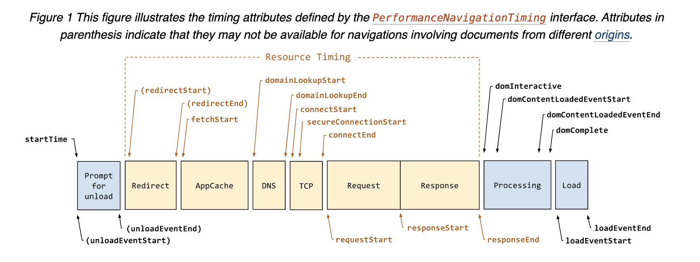
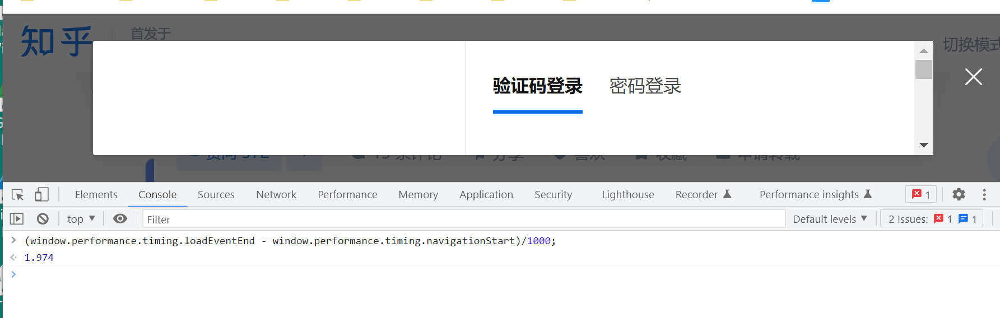

本文主要探索自动化测试领域，如何获取前端页面性能的一些方式方法。

1. 浏览器性能对象的timing属性：window.performance.timing

2. 浏览器性能对象的资源属性： window.performance.getEntries()

3. selenium调用devtools工具的performance功能。

4. 埋点

5. 人为认定时间差

6. opencv技术

   

#### 常用的性能指标和它的意义


#### Performance.Timing

在vue等SPA（single-page-application）应用出现之前，W3C针对前端发展过程（Navigation Timing）制定有了Level1和Level2两个版本的加载过程的性能模型和各项指标。如下图：

1. 当导航开始，网页发生跳转（redirect），伪同时，原网页开始销毁（upload）
2. 等待请求回来后，开始根据js、css、xmlhttprequest等生成DOM树，完成渲染过程
3. 加载完成显示至网页上
4. 重复


而Navigation Timing 的level2 版本，继续深化加强了对获取资源的阶段的规范，定义面向resource的Resource Timing对象，以更细化过程性能。



那么怎么说？ 看例：

1. 直接在devtools上的console功能中调用API，进行差值运行，即可得到网页渲染总耗时。

```js
window.performance.timing.loadEventEnd - window.performance.timing.navigationStart
```

我们以知乎的一个页面为例观察下。从network模块或者performance模块捕获，或者人为感知下，判断这个页面是渲染大概是2S左右，而network的timeline显示是1.97S。而在红线之后（2S到3.5S这段时间）没做啥事情，那我认为这个页面渲染完全渲染和大部分渲染是成立。那这个1.97S怎么能被获取到呢。


我们可以直接在控制台执行API来获取，得到的结果，就是这个Load的值。哦， nice！



那么，自动化就好办了。存在页面路由List： [A,B,C]，只要打开网页，等待一段时间，然后执行js，就可以获取到性能时间，哇塞，这通用性这么强吗...

```python
driver = ...

def getPerformanceTime(route):
    driver.get(route)
    time.sleep(20) 
    Thetime = driver.execute_script("(window.performance.timing.loadEventEnd - window.performance.timing.navigationStart)/1000")
    return {route:Thetime}

def main(routeList):
    result = map(getPerformanceTime, routeList)
```

不过我试过多次，这个时间多少有些误差，不过不大。


#### Performance.getEntries